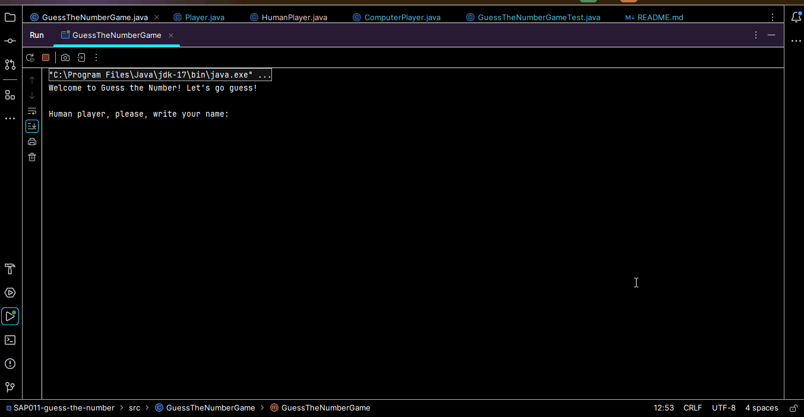
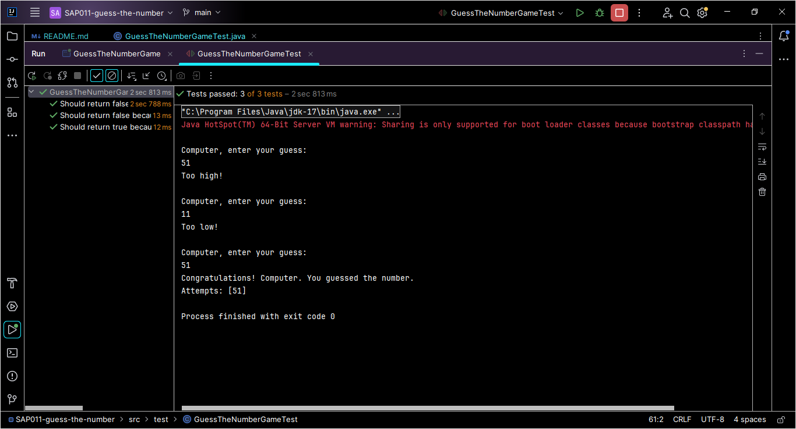

# Guess the Number Game 🎲🎮

## Índice

- [1. Resumo do Projeto](#1-resumo-do-projeto)
- [2. Criação dos testes unitários](#2-criação-dos-testes-unitários)
- [3. Tecnologias utilizadas](#3-tecnologias-utilizadas)
- [4. Implementação futura](#4-implementação-futura)
- [5. Desenvolvedora](#5-desenvolvedora)

---

## 1. Resumo do Projeto

É um jogo interativo que se realiza no terminal, no qual a
jogadora e o computador se alternam para tentar adivinhar um número
aleatório entre 1 e 100. Deve-se levar em consideração a tentativa anterior, se
foi "muito alta" ou "muito baixa".

## 2. Criação dos testes unitários

Criação dos testes unitários que se preocupam em cobrir os seguintes comportamentos:

* Simulação se o palpite da jogadora é maior que o número alvo.
* Simulação se o palpite da jogadora é menor que o número alvo.
* Simulação se o palpite é o próprio número alvo.

## 3. Tecnologias utilizadas

 

## 4. Implementação futura

Criação de uma "inteligência" para jogar contra o computador.
Desenvolvimento de uma lógica para que os palpites da segunda jogadora, quando estiver jogando contra o computador, sejam palpites mais inteligentes. Esses palpites podem considerar a informação se o palpite é alto ou baixo em relação ao número alvo e assim o jogo se torna mais emocionante. 

## 5. Desenvolvedora
 
Isabela Tenório

* GitHub: [@isabelatenorio](https://github.com/belatenorio)
* Linkedin: [Isabela Tenório](https://www.linkedin.com/in/isabelatenorioadv/)

